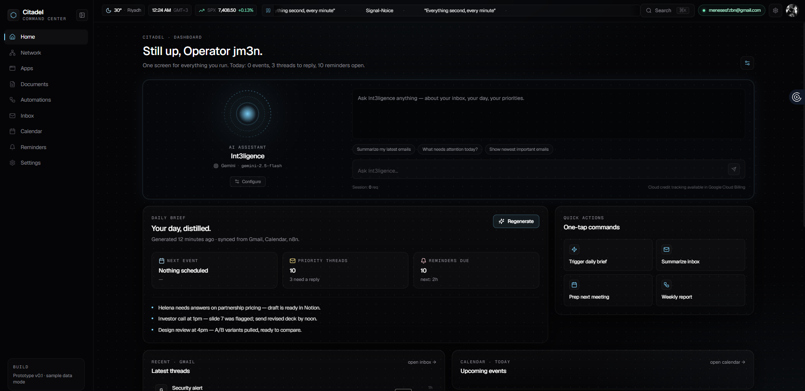
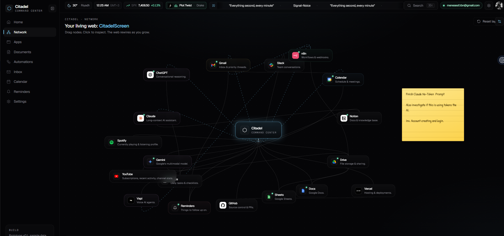
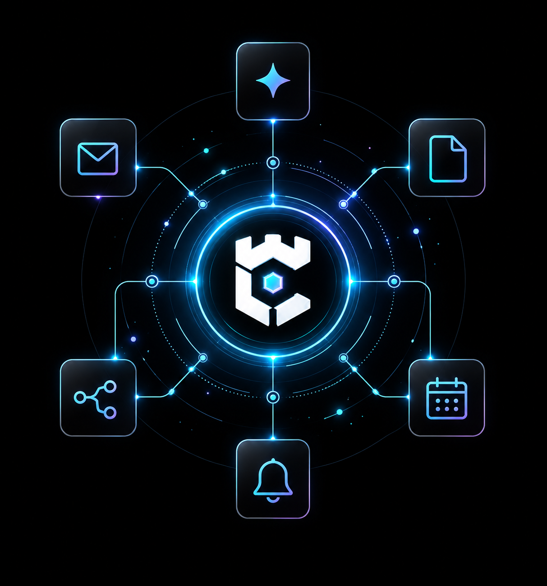
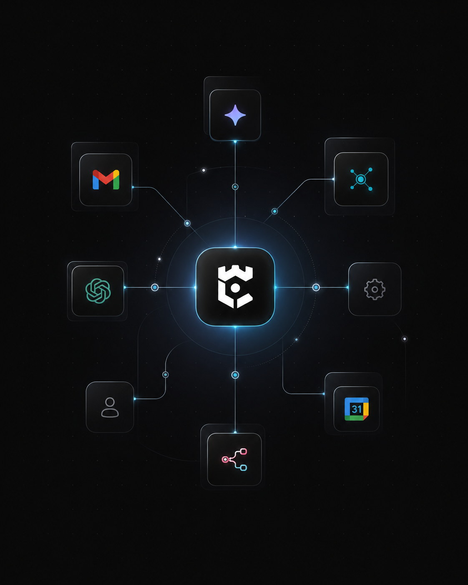

# Citadelscreen

Citadelscreen is a personal command center that connects everyday tools in a visual workspace. Switch between an interactive node graph and a dashboard to reach mail, calendars, documents, reminders, and connected services.

## Preview

### Dashboard



### Connected workspace



<details>
<summary>Showcase artwork</summary>

<p align="center">
  
  
</p>

</details>

## Features

- Draggable app and reminder nodes with saved layouts and a side panel for details.
- Dashboard, network, apps, automations, inbox, mail, calendar, documents, reminders, and settings pages.
- Google account connections for Gmail, Calendar, Drive, Docs, Sheets, and YouTube, including multiple Google accounts.
- Service connections for tools such as GitHub, Spotify, Notion, Slack, Linear, Figma, Discord, Vercel, and n8n.
- Configurable AI assistants with provider connections and contextual tools.
- Local notes, tasks, uploaded documents, themes, and workspace preferences.

Individual integrations require their own credentials and provider setup. Some surfaces use sample data or workflow placeholders until configured.

## Stack

Next.js 14, React 18, TypeScript, Tailwind CSS, React Flow, Framer Motion, Zustand, SWR, and NextAuth.

## Local development

Use Node.js 20 or newer and npm.

```bash
npm ci
npm run dev -- --hostname 127.0.0.1
```

Open [http://127.0.0.1:3000](http://127.0.0.1:3000). Create `.env.local` in the repository root to configure connections:

```dotenv
NEXTAUTH_URL=http://127.0.0.1:3000
NEXTAUTH_SECRET=replace-with-a-random-secret
TOKEN_ENCRYPTION_KEY=replace-with-an-independent-random-secret
GOOGLE_CLIENT_ID=your-google-client-id
GOOGLE_CLIENT_SECRET=your-google-client-secret
```

Generate independent secrets with `openssl rand -base64 32`. For Google OAuth, register `http://127.0.0.1:3000/api/auth/callback/google` as a redirect URI. Enable the APIs used by your connected surfaces. The current authorization flow requests Gmail modification access as well as read access for Calendar, Drive metadata, Docs, Sheets, and YouTube.

Optional providers have separate configuration. For example, GitHub uses `GITHUB_CLIENT_ID` and `GITHUB_CLIENT_SECRET`; Spotify uses `SPOTIFY_CLIENT_ID`, `SPOTIFY_CLIENT_SECRET`, and optionally `SPOTIFY_REDIRECT_URI`. Inspect the relevant module under `src/lib/providers/` or its connection route before enabling a service.

## Production build

```bash
npm run serve   # Build and start on 127.0.0.1:3000
```

After building, `npm start` reuses the build. Local production output is stored in `.next-production`; development and Vercel use `.next`.

## Storage and hosting

Workspace preferences and local tasks persist in browser storage. Uploaded file blobs use IndexedDB. Connected Google account tokens are encrypted using `TOKEN_ENCRYPTION_KEY` and stored in the gitignored `data/connected-accounts.json` file.

The account store is designed for a single-user local installation with writable persistent disk. A serverless deployment needs a persistent storage strategy for those account records; a successful build alone does not provide it. Keep `.env.local`, OAuth tokens, and the `data/` directory private.

## Repository layout

- `src/app/`: pages, OAuth callbacks, and integration API routes.
- `src/components/citadel/`: workspace nodes, panels, and dashboard components.
- `src/lib/`: providers, account storage, state, and assistant tools.
- `src/lib/data/`: sample content for unconnected surfaces.
- `public/logos/`: service and application artwork.

Run `npm run build` to compile and `npm run lint` for the configured lint command.
